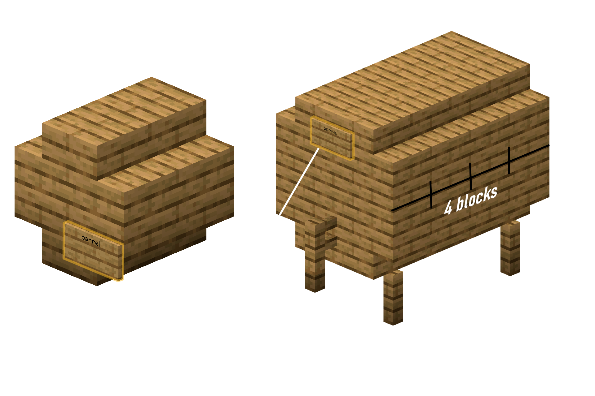

# How to brew?

After installing and configuring, it is time to brew some Potions. Unlike in vanilla Minecraft it is not as easy as adding an Ingredient to a Brewing Stand and waiting for it to finish. Depending on the Recipe the whole process can be difficult and time consuming. Some Recipes may need a high precision when it comes to Ingredients or any other step in the process. If one step was not good enough, the quality of the Potions may suffer, leading to side effects like bad alcohol and other toxics.

This new difficulty of brewing of the good stuff makes only sense, if the players are not aware of the exact Recipes for at least the more valuable Potions (like Rum). This makes high quality Potions worth much more and an experimenting and perfecting of the Brewing Process would be promoted.

Depending on the Recipe, some Steps may not be needed, the following instruction describes the common procedure of brewing.

## Fermenting

Step one consists of Fermenting the fresh Ingredients.

1. Place Cauldron over a Fire/Lava/Magma/other heat source

2. Fill it with water

3. Add proper Ingredients via right clicking with them onto cauldron

4. Use a **Clock** on a Cauldron to see how long the drink is brewed

5. When needed - rightclick cauldron with glass bottles to get your drink

6. ???

7. You're awesome!

## Distilling

Some recipes need distilling and it's very easy process!

1. Put the bottle with ferment into the brewing stand

2. Put glowstone dust as filter on top into the brewing stand (The filter will not be consumed)

3. Wait some time

4. ???

5. You're awesome!

## Aging

Most of drinks need **to age** from base potion to drink or to get better quality. Aging is just... waiting!

For that you need a **Barrel**. You can use default Minecraft barrel as **Oak barrel** that can contain up to 6 drinks or build multiblock structure if drink has to age in different type of wood. Structure barrels also can store more brews than default barrel!

After you put your drinks in barrels, you need to just wait! 1 "year" is equals 1 in-game day. If you overdo the drink or use the wrong type of wood, the drink is likely to spoil.