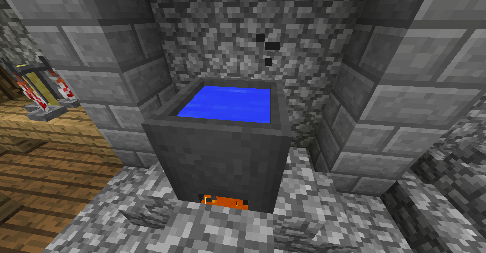
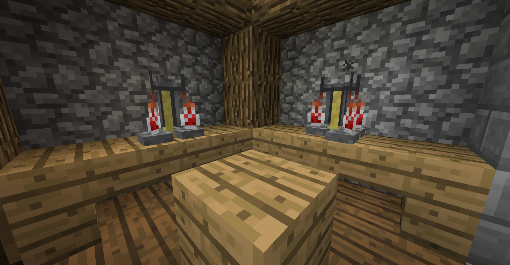

# Как варить?

Время варки! BreweryX предлагает уникальную систему варки напитков с помощью **Ферментирования**, **Брожения** и **Дистилляции**! В варке напитков самое важное - следовать рецепту, ведь, в зависимости от установленной сложности напитка, брага может получится неудачной.

Для варки подготовь Котёл, Варочную стойку и Бочку.

## Ферментирование

Здесь мы начинаем варить напиток по ингредиентам!

1. Поставь Котёл над любым горящим блоком - Огонь/Лава/Магма/Прочее

2. Наполни котёл водой

3. Добавь необходимые ингредиенты в котёл, нажимая ПКМ

4. ПКМ по котлу **Часами** покажет в чат сколько времени напиток варится

5. Когда нужно - нажми ПКМ по котлу **пустыми колбами**, чтобы наполнить их напитком

6. ???

7. ПРОФИТ!

## Дистилляция

Некоторым рецептам нужна дистиляция.

1. Положи напиток в зельеварочную стойку

2. Положи **светопыль** в верхний слот

3. Подожди пока дистиляция пройдёт

4. ???

5. ПРОФИТ!

## Брожение

Многим напиткам нужно **забродить** из браги в напиток или чтобы улучшить качество напитка. А брожжение это просто... ожидание!

Для этого тебе нужна **Бочка**. Ты можешь использовать обычную бочку из Майнкрафта, она будет работать как бочка **из дуба** и вмещает в себя 6 напитков. Но также ты можешь построить структуру - среднюю или большую бочку. Они нужны, если в рецепте необходимо определенное дерево или просто для увеличения слотов!

После того, как ты положил напитки в бочки, тебе достаточно просто ждать! 1 "год" в BreweryX равняется 1 внутриигровому дню.